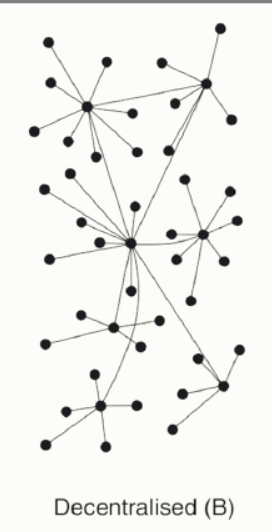
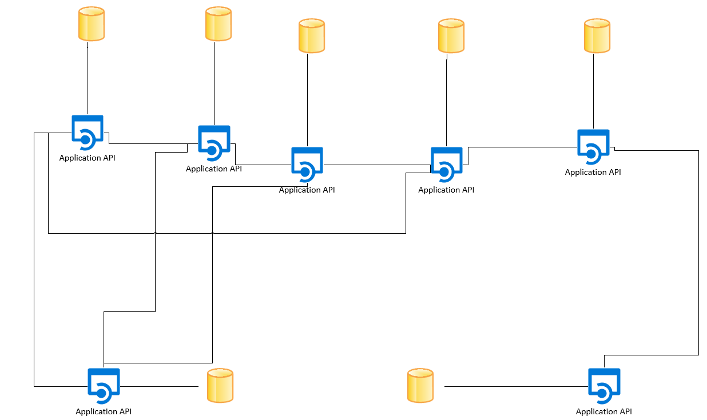
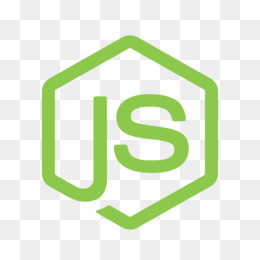

# Challenge48h
**Challenge48H**
In this project, you represent an association who whant to create a decentralised marketplace where you can be an User or a seller and buy objects. This project should not have a Based Entity. Were the data are gathered in differents instances who represents a group of sellers and/or Users. Where the User can use it to buy Objects from the local instance but also from the external group. 

**where to start ?**
If you want to experiment the project you can try it here, this is the github link : https://github.com/MehdiArroussi/Challenge48h, but you should be able to use VS code to exploit the content. Also a bit of knowledge of PHP and SQL were used to comunicate with the Data Base, JavaScript and HTML/CSS were used to create the website and nodeJS, React, nodeJsReact, typescript were used to create the API and Docker.

**Wanted Idea :**
We got a set of API who got his own Data Base and give the data for the WebSite. all those API can comunicate with the others and ask for data. the model may not be dangered because there is no main API so if an API is shutdown, the other APIs can continue to communicate

**Licences**
So in this projet we use PHP, SQL, JavaScript, HTML/CSS, nodeJS, React, typescript, Wamp, MyPhpAdmin, Adonis, Docker, Mginx, CiscoPacketTracer.

**Collaborators**
We were 6 to work, Mehdi ARROUSSI, Emeric BAROTIN, Lenny OLAX-BARGAIN, Rémi LAURENT  worked in the website and the Sql Requests. Pierric COME did create the API Lily BOURGUEREAU worked on the Network administration with Cisco Packet Tracer, Docker and Mginx.